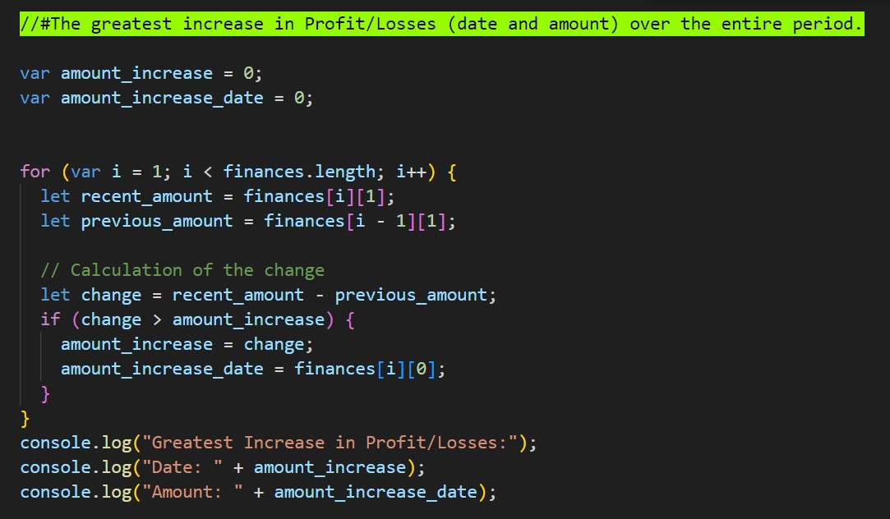

# console_finances
This is Financial analysis tool.

## Overview

I have created the financial analysing tool by writing the  code for analyzing the financial records of a company. I have written this code by using the dataset provided in this `starter/index.js` file.

## Instructions and completion of tasks:

1. Create a new GitHub repo called `Console-Finances`. Then, clone it to your computer.
### I have Create a new GitHub repo called `console_finances`. Then, cloned it to my computer.

2. Copy the starter files in your local git repository.
### I have copied the starter files in my local git repository.


3. Your task is to write JavaScript code that analyzes the records to calculate each of the following:

* The total number of months included in the dataset.
### I have written the code in index.js file, which shows the total of months in console of browser.


* The net total amount of Profit/Losses over the entire period.
###  I have written the code in index.js file, which shows the total amount of Profit/Losses over the entire period in which can be seen in console of browser.


* The average of the changes in Profit/Losses over the entire period. You will need to track what the total change in Profit/Losses are from month to month and then find the average. (`Total/(Number of months - 1)`
### I have written the code in index.js file, which shows verage of the **changes** in Profit/Losses over the entire period which can be seen in console of browser.


* The greatest increase in Profit/Losses (date and amount) over the entire period.
### I have written the code in index.js file, which shows the greatest increase in Profit/Losses (date and amount) over the entire period which can be seen in console of browser.



* The greatest decrease in Profit/Losses (date and amount) over the entire period.
### I have written the code in index.js file, which shows the greatest decrease in Profit/Losses (date and amount) over the entire period which can be seen in console of browser.


4. When you open your code in the browser your resulting analysis should look similar to the following:
  ```text
  Financial Analysis 
  ----------------
  Total Months: 86
  Total: $38382578
  Average Change: -2315.12
  Greatest Increase in Profits/Losses: Feb-2012 ($1926159)
  Greatest Decrease in Profits/Losses: Sep-2013 ($-2196167)
  ```
Your final code should print the analysis to the console.
### My final code shows the same results.

**Hints:**


### Deployment: 

* The URL of the deployed application.

https://aftabahmad888.github.io/console_finances/

* The URL of the GitHub repository that contains your code. Give the repository a unique name and include a README file that describes the project.

https://github.com/aftabahmad888/console_finances